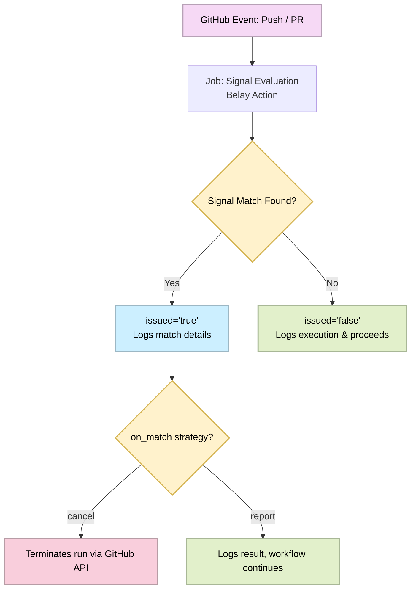

<!--suppress HtmlDeprecatedAttribute, HtmlUnknownTarget -->
<div align="center">
  <!--
  =====================
         HEADER
  =====================
  -->
  <br />
  <a rel="noopener noreferrer" href="https://github.com/OctalMesh/belay-action">
    <picture>
      <source media="(prefers-color-scheme: light)" srcset="./.github/assets/svg/belay_logo.svg">
      
    </picture>
  </a>
  <br /><br /><br />
  <!--
  =====================
         BADGES
  =====================
  -->
  <div>
    <!-- Repo Stars Badge -->
    <a rel="noopener noreferrer" href="https://github.com/OctalMesh/belay-action/stargazers">
      <picture>
        <source media="(prefers-color-scheme: light)" srcset="https://img.shields.io/github/stars/OctalMesh/belay-action?style=for-the-badge&logo=starship&color=363636&labelColor=464646" />
        
      </picture>
    </a>
    <!-- Repo Contributors Badge -->
    <a rel="noopener noreferrer" href="https://github.com/OctalMesh/belay-action/contributors">
      <picture>
        <source media="(prefers-color-scheme: light)" srcset="https://img.shields.io/github/contributors/OctalMesh/belay-action?style=for-the-badge&logo=githubsponsors&logoColor=fff&color=363636&labelColor=464646" />
        
      </picture>
    </a>
    <!-- Version Badge -->
    <a rel="noopener noreferrer" href="https://github.com/OctalMesh/belay-action/releases/latest">
      <picture>
        <source media="(prefers-color-scheme: light)" srcset="https://img.shields.io/github/v/release/OctalMesh/belay-action?style=for-the-badge&color=363636&labelColor=464646&logo=data:image/svg%2bxml;base64,PHN2ZyB4bWxucz0iaHR0cDovL3d3dy53My5vcmcvMjAwMC9zdmciIHdpZHRoPSIxNiIgaGVpZ2h0PSIxNiI+PHBhdGggZmlsbD0iI2ZmZiIgZD0iTTEgNy44di01UTEuMiAxLjIgMi44IDFoNXEuNyAwIDEuMi41bDYuMyA2LjNhMiAyIDAgMCAxIDAgMi40bC01IDVhMiAyIDAgMCAxLTIuNSAwTDEuNSA5QTIgMiAwIDAgMSAxIDcuOG0xLjUgMFY4bDYuMyA2LjJoLjRsNS01di0uNEw4IDIuNmwtLjItLjFoLTVsLS4zLjNaTTYgNWExIDEgMCAxIDEgMCAyIDEgMSAwIDAgMSAwLTIiLz48L3N2Zz4=" />
        
      </picture>
    </a>
    <br />
    <!-- Repo Views Badge -->
    <a rel="noopener noreferrer" href="https://hits.sh/github.com/OctalMesh/belay-action">
      <picture>
        <source media="(prefers-color-scheme: light)" srcset="https://hits.sh/github.com/OctalMesh/belay-action.svg?style=for-the-badge&label=Views&logo=github&color=363636&labelColor=464646" />
        
      </picture>
    </a>
    <!-- License Badge -->
    <a rel="noopener noreferrer" href="LICENSE.md">
      <picture>
        <source media="(prefers-color-scheme: light)" srcset="https://img.shields.io/github/license/OctalMesh/belay-action?style=for-the-badge&color=363636&labelColor=464646&logo=data:image/svg%2bxml;base64,PHN2ZyB4bWxucz0iaHR0cDovL3d3dy53My5vcmcvMjAwMC9zdmciIHdpZHRoPSIxNiIgaGVpZ2h0PSIxNiI+PHBhdGggZmlsbD0iI2ZmZiIgZD0iTTguOC44VjJoMXEuMyAwIC44LjJsMS4zLjhoMi40YS44LjggMCAwIDEgMCAxLjVoLS41TDE2IDkuMmExIDEgMCAwIDEtLjEuOGwtLjUtLjUuNS41di4xbC0uOC40cS0uNi41LTIgLjVhNSA1IDAgMCAxLTItLjVsLS43LS40YTEgMSAwIDAgMS0uMi0xbDItNC42cS0uNiAwLTEtLjJMMTAgMy41SDguN1YxM2gyLjZhLjguOCAwIDAgMSAwIDEuNUg0LjhhLjguOCAwIDAgMSAwLTEuNWgyLjVWMy41SDZMNSA0LjNsLTEgLjIgMiA0LjdhMSAxIDAgMCAxLS4xLjhsLS41LS41LjUuNXYuMWwtLjguNHEtLjYuNS0yIC41YTUgNSAwIDAgMS0yLS41bC0uNy0uNEExIDEgMCAwIDEgMCA5bDItNC42aC0uNGEuOC44IDAgMCAxIDAtMS41aDIuNGwxLjMtLjguOS0uMmgxVi44YS44LjggMCAwIDEgMS41IDBtMi45IDguNHEuNC4zIDEuMy4zYy45IDAgMS0uMSAxLjMtLjNMMTMgNi4zWm0tMTAgMHEuNC4zIDEuMy4zYy45IDAgMS0uMSAxLjMtLjNMMyA2LjNaIi8+PC9zdmc+" />
        
      </picture>
    </a>
  </div>
  <h1></h1>
  <!--
  =====================
         SOURCES
  =====================
  -->
  <h6>
    <br />
    <a rel="noopener noreferrer" href="CODE_OF_CONDUCT.md">Code of Conduct</a>
    ·
    <a rel="noopener noreferrer" href="CONTRIBUTING.md">Contributing</a>
    ·
    <a rel="noopener noreferrer" href="SECURITY.md">Security Policy</a>
    ·
    <a rel="noopener noreferrer" href="SUPPORT.md">Support</a>
    ·
    <a rel="noopener noreferrer" href="LICENSE.md">License</a>
    ·
    <a rel="noopener noreferrer" href="examples/README.md">Examples</a>
  </h6>
</div>
<div align="justify">
  <!--
  =====================
       DESCRIPTION
  =====================
  -->
  <p>
    Belay is a signal-based workflow control action for GitHub Actions. It
    evaluates commit messages, pull request titles, and labels against
    configured signals - tags, regex patterns, and PR labels - and issues a
    belay order when a match is found. On match, Belay can either report the
    result via output for the caller to act on, or cancel the workflow run
    entirely via the GitHub API.
  </p>
</div>

<div align="center">
  <h2>Overview</h2>
</div>

Belay solves a common CI/CD problem: running expensive workflows on commits that
don't need them. Instead of duplicating skip logic across every workflow with
bash scripts and environment variables, Belay centralizes signal detection into
a single reusable action.

| Concept         | Description                                                                               |
|-----------------|-------------------------------------------------------------------------------------------|
| **Signal**      | A condition that triggers a belay order - a tag substring, a regex pattern, or a PR label |
| **Belay order** | The result of signal evaluation - issued when any configured signal matches               |
| **On match**    | The action executed when a belay order is issued - `report` or `cancel`                   |
| **Issued**      | The `issued` output - `"true"` if any signal matched, `"false"` otherwise                 |

<div align="center">
  <h2>How It Works</h2>
</div>

The following diagram illustrates the lifecycle of a GitHub workflow run when
evaluated by Belay Action:



<div align="center">
  <h2>Usage</h2>
</div>

### Report mode

The default mode. Belay sets the `issued` output and logs the result. The caller
decides what to do next.

```yaml
jobs:
  check:
    name: "Skip Check"
    runs-on: ubuntu-latest
    outputs:
      should_skip: ${{ steps.belay.outputs.issued }}
    steps:
      - name: "Setup: Checkout repository"
        uses: actions/checkout@v6

      - name: "Run: Belay"
        id: belay
        uses: OctalMesh/belay-action@v1
        with:
          signal_tags: "[ci-skip],[skip-ci]"
          signal_labels: "ci-skip,skip-ci"

  build:
    needs: check
    if: needs.check.outputs.should_skip != 'true'
    runs-on: ubuntu-latest
    steps:
      - run: pnpm build
```

### Cancel mode

Belay cancels the entire workflow run via the GitHub API when a signal is
matched. The run is marked as **canceled**, not failed.

```yaml
jobs:
  check:
    name: "Skip Check"
    runs-on: ubuntu-latest
    permissions:
      actions: write # Required for cancel mode
    steps:
      - name: "Setup: Checkout repository"
        uses: actions/checkout@v6

      - name: "Run: Belay"
        uses: OctalMesh/belay-action@v1
        with:
          signal_tags: "[ci-skip],[skip-ci]"
          on_match: "cancel"
```

> [!NOTE]
> Cancel mode requires `actions: write` permission on the job or workflow level.
> The `github_token` input defaults to `${{ github.token }}` and is passed
> automatically - no manual configuration needed in most cases.

### Regex patterns

Use `signal_patterns` for more expressive matching. Patterns are evaluated
as standard JavaScript regular expressions.

```yaml
- uses: OctalMesh/belay-action@v1
  with:
    signal_patterns: "^chore\\(deps\\),^chore\\(release\\)"
    signal_labels: "dependencies,release"
    on_match: "cancel"
```

> [!TIP]
> Escape backslashes in YAML - `\(` becomes `\\(` in the input string.

<div align="center">
  <h2>Inputs</h2>
</div>

| Input             | Required | Default               | Description                                                                             |
|-------------------|----------|-----------------------|-----------------------------------------------------------------------------------------|
| `signal_tags`     | No       | `[ci-skip],[skip-ci]` | Comma-separated substrings to match against the commit message and PR title             |
| `signal_patterns` | No       | -                     | Comma-separated regex patterns to match against the commit message and PR title         |
| `signal_labels`   | No       | `ci-skip,skip-ci`     | Comma-separated PR label names that trigger a belay order                               |
| `on_match`        | No       | `report`              | Action to execute on match. Accepted values: `report`, `cancel`                         |
| `github_token`    | No       | `${{ github.token }}` | GitHub token used to cancel the workflow run. Required only when `on_match` is `cancel` |

<div align="center">
  <h2>Outputs</h2>
</div>

| Output   | Description                                               |
|----------|-----------------------------------------------------------|
| `issued` | `"true"` if a belay order was issued, `"false"` otherwise |

> [!NOTE]
> The `issued` output is always set regardless of the `on_match` value.
> In `cancel` mode it is still available to subsequent steps that run before
> the cancellation is processed.

<div align="center">
  <h2>Signals</h2>
</div>

Belay evaluates three independent signal types. A belay order is issued if
**any** signal matches.

### Tags

Substring matching against the commit message and PR title. Fast and simple -
use for conventional skip markers.

```yaml
signal_tags: "[ci-skip],[skip-ci],[docs-only]"
```

Matches any commit message or PR title that contains at least one of the listed
substrings.

### Patterns

Regex matching against the commit message and PR title. Use when tag matching
is too broad, or you need anchored, structured patterns.

```yaml
signal_patterns: "^chore\\(deps\\),^docs:"
```

Each pattern is compiled as a JavaScript `RegExp` and tested independently.
The first match issues a belay order.

### Labels

PR label matching. Evaluated only on `pull_request` events - on `push` events
the label list is empty and this signal never matches.

```yaml
signal_labels: "ci-skip,dependencies,release"
```

> [!TIP]
> Combine all three signal types in a single step. Belay evaluates them in
> parallel and stops at the first match.

<div align="center">
  <h2>Permissions</h2>
</div>

| Mode     | Required permission        |
|----------|----------------------------|
| `report` | `contents: read` (default) |
| `cancel` | `actions: write`           |

Permissions can be set at the workflow or job level:

```yaml
permissions:
  contents: read
  actions: write
```

<div align="center">
  <!--
  =====================
         FOOTER
  =====================
  -->
  <h1></h1>
  <br />
  <!-- OctalMesh Logo -->
  <a rel="noopener noreferrer" target="_blank" href="https://octalmesh.com">
    <picture>
      <source media="(prefers-color-scheme: light)" srcset="https://raw.githubusercontent.com/OctalMesh/OctalDesign/release/assets/logo/svg/octal_mesh_center.svg" />
      
    </picture>
  </a>
  <br /><br />
  <!-- Socials -->
  <div>
    <!-- Telegram Badge -->
    <a rel="noopener noreferrer" target="_blank" href="https://octalmesh.com/telegram">
      <picture>
        <source media="(prefers-color-scheme: light)" srcset="https://raw.githubusercontent.com/OctalMesh/OctalDesign/release/assets/icon/svg/telegram.svg" />
        
      </picture>
    </a>
    &nbsp;
    <!-- YouTube Badge -->
    <a rel="noopener noreferrer" target="_blank" href="https://octalmesh.com/youtube">
      <picture>
        <source media="(prefers-color-scheme: light)" srcset="https://raw.githubusercontent.com/OctalMesh/OctalDesign/release/assets/icon/svg/youtube.svg" />
        
      </picture>
    </a>
    &nbsp;
    <!-- TikTok Badge -->
    <a rel="noopener noreferrer" target="_blank" href="https://octalmesh.com/tiktok">
      <picture>
        <source media="(prefers-color-scheme: light)" srcset="https://raw.githubusercontent.com/OctalMesh/OctalDesign/release/assets/icon/svg/tiktok.svg" />
        
      </picture>
    </a>
    &nbsp;
    <!-- Instagram Badge -->
    <a rel="noopener noreferrer" target="_blank" href="https://octalmesh.com/instagram">
      <picture>
        <source media="(prefers-color-scheme: light)" srcset="https://raw.githubusercontent.com/OctalMesh/OctalDesign/release/assets/icon/svg/instagram.svg" />
        
      </picture>
    </a>
    &nbsp;
    <!-- X Badge -->
    <a rel="noopener noreferrer" target="_blank" href="https://octalmesh.com/x">
      <picture>
        <source media="(prefers-color-scheme: light)" srcset="https://raw.githubusercontent.com/OctalMesh/OctalDesign/release/assets/icon/svg/x.svg" />
        
      </picture>
    </a>
    &nbsp;
    <!-- Reddit Badge -->
    <a rel="noopener noreferrer" target="_blank" href="https://octalmesh.com/reddit">
      <picture>
        <source media="(prefers-color-scheme: light)" srcset="https://raw.githubusercontent.com/OctalMesh/OctalDesign/release/assets/icon/svg/reddit.svg" />
        
      </picture>
    </a>
  </div>
</div>
<h6>
  <div align="center">
    • • •
    <br /><br />
    This project is licensed under the <a rel="noopener noreferrer" href="LICENSE.md">MIT License</a>
    <br /><br />
  </div>
  <div align="justify">
    <ul>
      <li>Feel free to use this project for any purpose, including commercial applications.</li>
      <li>You are permitted to modify, distribute, and include this project in any form, as long as the original copyright notice is retained.</li>
      <li>If you share or publish modified versions, attribution to the original <a rel="noopener noreferrer" href="https://github.com/OctalMesh/belay-action">GitHub repository</a> is appreciated.</li>
      <li>This software is provided "as is", without any warranties or guarantees, as detailed in the license terms.</li>
    </ul>
  </div>
</h6>
