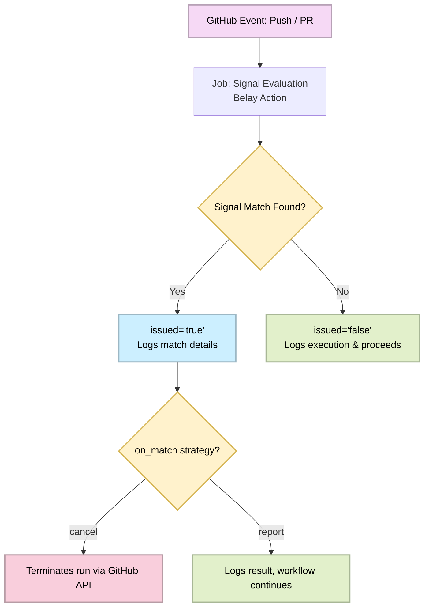

<!--suppress HtmlDeprecatedAttribute, HtmlUnknownTarget -->
<div align="center">
  <h1>Usage Examples</h1>
  <p>Reference GitHub Actions workflow configurations for <strong>Belay</strong></p>
  <h6>
    <a rel="noopener noreferrer" href="../README.md"><- Back to main README</a>
    &nbsp;·&nbsp;
    <a rel="noopener noreferrer" href="../CONTRIBUTING.md">Contributing</a>
    &nbsp;·&nbsp;
    <a rel="noopener noreferrer" href="../LICENSE.md">License</a>
  </h6>
</div>

<div align="center">
  <h2>What's inside</h2>
</div>

```
examples/
├── README.md         <- This reference guide
├── cancel-mode.yaml  <- Workflow template using aggressive cancellation mode
└── report-mode.yaml  <- Workflow template using non-intrusive output reporting
```

> [!NOTE]
> These are reference templates - not a runnable project on their own. Copy the
> relevant files into your `.github/workflows/` directory and adapt them to your
> needs.

<div align="center">
  <h2>Concept Reference</h2>
</div>

Belay centralizes condition evaluation and workflow execution control. Instead
of duplicating complex inline bash scripts, regex triggers, and environment
variable logic across multiple steps, you drop Belay into an isolated guard job
to process incoming metadata and control downstream execution flow.



> [!NOTE]
> The issued output is always set to `true` whenever a signal matches,
> regardless of the `on_match` configuration.

<div align="center">
  <h2>Configuration Examples</h2>
</div>

Ready-to-copy YAML templates covering both operational modes of the action.

### `report-mode.yaml`

Demonstrates Report Mode (default) - used for modular workflows where execution
path gating or job-level conditioning is required based on specific commit,
pattern, or label states.

#### Copy and adapt to your workflows

```bash
cp examples/report-mode.yaml ./.github/workflows/hev-telemetry.yaml
```

### `cancel-mode.yaml`

Demonstrates Cancel Mode - an aggressive cost-saving strategy that calls the
GitHub API to completely mark the workflow run as Canceled the moment a
signal is detected.

> [!IMPORTANT]
> Cancel mode requires `actions: write` permission on the job or workflow level,
> as it interacts directly with GitHub's run orchestration endpoints.

#### Copy and adapt to your workflows

```bash
cp examples/cancel-mode.yaml ./.github/workflows/resonance-cascade.yaml
```

<div align="center">
  <!--
  =====================
         FOOTER
  =====================
  -->
  <h1></h1>
  <br />
  <!-- OctalMesh Logo -->
  <a rel="noopener noreferrer" target="_blank" href="https://octalmesh.com">
    <picture>
      <source media="(prefers-color-scheme: light)" srcset="https://raw.githubusercontent.com/OctalMesh/OctalDesign/release/assets/logo/svg/octal_mesh_center.svg" />
      
    </picture>
  </a>
  <br /><br />
  <!-- Socials -->
  <div>
    <!-- Telegram Badge -->
    <a rel="noopener noreferrer" target="_blank" href="https://octalmesh.com/telegram">
      <picture>
        <source media="(prefers-color-scheme: light)" srcset="https://raw.githubusercontent.com/OctalMesh/OctalDesign/release/assets/icon/svg/telegram.svg" />
        
      </picture>
    </a>
    &nbsp;
    <!-- YouTube Badge -->
    <a rel="noopener noreferrer" target="_blank" href="https://octalmesh.com/youtube">
      <picture>
        <source media="(prefers-color-scheme: light)" srcset="https://raw.githubusercontent.com/OctalMesh/OctalDesign/release/assets/icon/svg/youtube.svg" />
        
      </picture>
    </a>
    &nbsp;
    <!-- TikTok Badge -->
    <a rel="noopener noreferrer" target="_blank" href="https://octalmesh.com/tiktok">
      <picture>
        <source media="(prefers-color-scheme: light)" srcset="https://raw.githubusercontent.com/OctalMesh/OctalDesign/release/assets/icon/svg/tiktok.svg" />
        
      </picture>
    </a>
    &nbsp;
    <!-- Instagram Badge -->
    <a rel="noopener noreferrer" target="_blank" href="https://octalmesh.com/instagram">
      <picture>
        <source media="(prefers-color-scheme: light)" srcset="https://raw.githubusercontent.com/OctalMesh/OctalDesign/release/assets/icon/svg/instagram.svg" />
        
      </picture>
    </a>
    &nbsp;
    <!-- X Badge -->
    <a rel="noopener noreferrer" target="_blank" href="https://octalmesh.com/x">
      <picture>
        <source media="(prefers-color-scheme: light)" srcset="https://raw.githubusercontent.com/OctalMesh/OctalDesign/release/assets/icon/svg/x.svg" />
        
      </picture>
    </a>
    &nbsp;
    <!-- Reddit Badge -->
    <a rel="noopener noreferrer" target="_blank" href="https://octalmesh.com/reddit">
      <picture>
        <source media="(prefers-color-scheme: light)" srcset="https://raw.githubusercontent.com/OctalMesh/OctalDesign/release/assets/icon/svg/reddit.svg" />
        
      </picture>
    </a>
  </div>
</div>
<h6>
  <div align="center">
    • • •
    <br /><br />
    This project is licensed under the <a rel="noopener noreferrer" href="LICENSE.md">MIT License</a>
    <br /><br />
  </div>
  <div align="justify">
    <ul>
      <li>Feel free to use this project for any purpose, including commercial applications.</li>
      <li>You are permitted to modify, distribute, and include this project in any form, as long as the original copyright notice is retained.</li>
      <li>If you share or publish modified versions, attribution to the original <a rel="noopener noreferrer" href="https://github.com/OctalMesh/belay-action">GitHub repository</a> is appreciated.</li>
      <li>This software is provided "as is", without any warranties or guarantees, as detailed in the license terms.</li>
    </ul>
  </div>
</h6>
